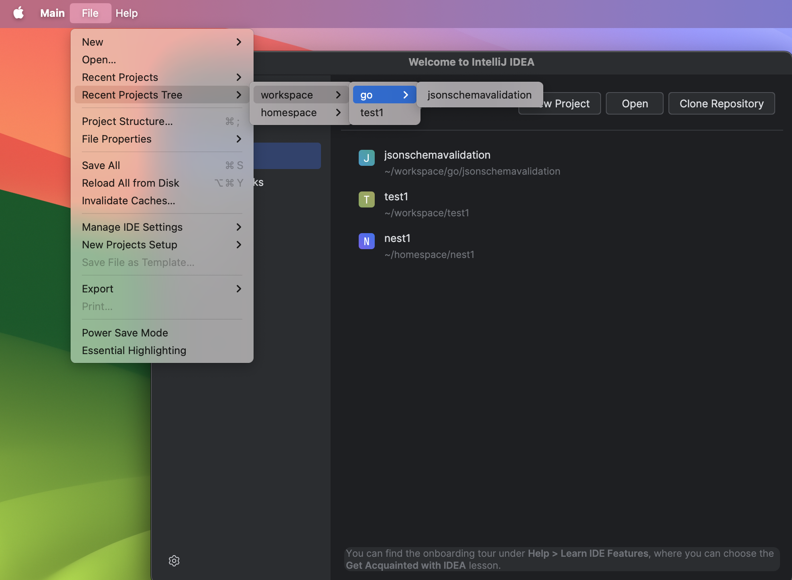

# Recent Projects Tree View (IntelliJ Plugin)

Organize your Recent Projects menu into tree view.

This plugin adds a new action to the File menu that shows your recent projects in a directory tree view, making it
easier to navigate large collections of projects that share common folder structures.

## Features

- Groups recent projects by their directory structure in a tree view
- Skips the currently open project to reduce clutter
- Works with the built-in Recent Projects list
- (Settings) Filter removed projects
- (Settings) Sort tree branches elements alphabetically

## Where to find it in the IDE

- Open IntelliJ IDEA (or any IntelliJ-based IDE)
- Go to: File → Recent Projects Tree

## Where to find the settings in the IDE

Go to: File → Settings → Tools → Recent Projects Tree
- Filter removed projects - filters out the project which were removed from the file system
- Sort tree branches elements alphabetically - Sorts all tree branch elements alphabetically to ensure easier and more consistent project tree navigation

## Build and Run (for developers)

This project uses the Gradle IntelliJ Plugin.

Prerequisites:

- Java 21+ (depending on your IDE version)
- Gradle (wrapper is included)

Common tasks:

- Build: `./gradlew build`
- Run IDE with the plugin: `./gradlew runIde`

## License

See the [LICENSE](./LICENSE) file for details.
